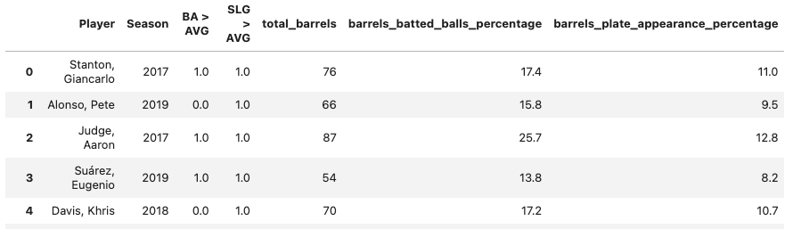
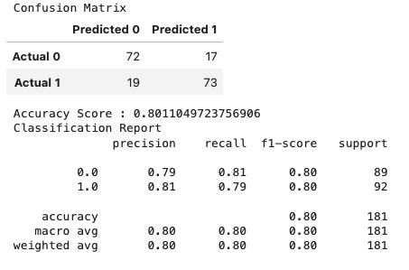
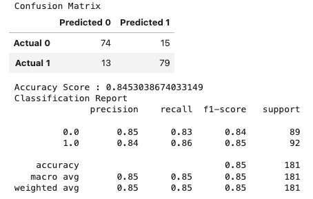
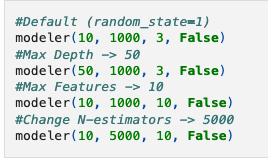
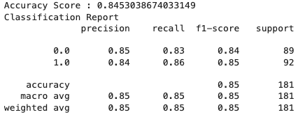

# Machine_Learning: Predicting MLB Batting Performance

Group Members:
Andrew Amato
Karesse Lockard
Steven Schiffner
Joshua Turk
Brian Morrissey

**Objective:** What batting statistic best predict hitter performance?  
In this analysis, a machine learning model was used to predict major league batter performance based on batter data from stathead.com and Statcast (via Kaggle.com). The data selected covers player batting statistics from 2017 – 2019. More recent data was not readily available, incomplete, or had too small of a sample size.

Data Cleaning Steps included:  
•	Load and clean the source datasets by removing unnecessary columns and renaming columns in preparation for a merge  
•	Merge the datasets into one dataframe and export as a .csv file  
•	Store the data and create a table using SQLite  

**Machine Learning Model**  
After evaluating multiple deep learning models, the Random Forest Model was selected to evaluate this dataset. The data was further prepared so that the random forest model can distinguishes above-average statistics (1) and below-average statistics (0) for the slugging average targets (dataframe shown below). 

Initial Target: SLG>AVG  
Initial Model Features:
                    	total_barrels	
                    	barrels_batted_balls_percentage	
                    	barrels_plate_appearance_percentage

After training and testing the model, the performance was summarized in a confusion matrix and classification report (shown below).

**Model Optimization**

**Attempt 1: Increasing Features**

Target: SLG>AVG   
Features:   
      	launch_angle   	
       	sweet_spot_percentage    	
        max_ev   	  
        average_ev      	
        fly_ball_line_drive_ev    	  
        ground_ball_ev     	
        max_distance     	
        average_distance      	
      	average_homerun   	  
       	hard_hit_95mph+  	    
        hard_hit_percentage      	
        hard_hit_swing_percentage      	
        total_barrels    	  
        barrels_batted_balls_percentage    	  
        barrels_plate_appearance_percentage      

After training and testing the model, the performance was summarized in a confusion matrix and classification report (shown below).  
  

A evaluation of the feature importance was run for the 15 features. The results are shown below.     

**Attempt 2: Adjusting Model Inputs**

Target: SLG>AVG     
Modifications:  

The model was tested and trained on each modification. The best performance was achived by changign the maximum depth and the confusion matrix and classification report for this outcome is shown below.  

**Data Sources:**  
Statcast Data   
https://www.kaggle.com/code/mattop/mlb-batting-exit-velocity-2015-2022-eda/input

Stathead Data   
https://stathead.com/baseball/player-batting-season-finder.cgi?request=1&year_min=2017&season_end=-1&season_start=1&order_by=b_hr&match=player_season&exactness=anymarked&comp_type=reg&draft_pick_type=overall&year_max=2019&weight_max=500&cstat%5B1%5D=b_ab&ccomp%5B1%5D=gt&cval%5B1%5D=150&offset=0

