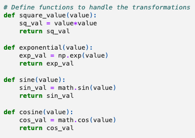
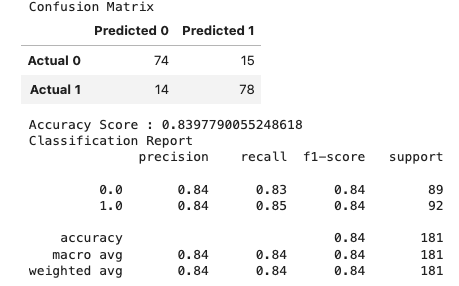

# Machine_Learning: Predicting MLB Batting Performance

Group Members:
Andrew Amato
Karesse Lockard
Steven Schiffner
Joshua Turk
Brian Morrissey

**Objective:** What batting statistic best predict hitter performance?  
In this analysis, a machine learning model was used to predict major league batter performance based on batter data from stathead.com and Statcast (via Kaggle.com). The data selected covers player batting statistics from 2017 – 2019. More recent data was not readily available, incomplete, or had too small of a sample size.

**Special Instructions for running notebook:** Make sure your version of Sklearn is version 1.4 or greater before running the notebook.

Data Cleaning Steps included:  
•	Load and clean the source datasets by removing unnecessary columns and renaming columns in preparation for a merge  
•	Merge the datasets into one dataframe and export as a .csv file  
•	Store the data and create a table using SQLite  

## **Machine Learning Model**  
After evaluating multiple deep learning models, the Random Forest Model was selected to evaluate this dataset. The data was further prepared so that the random forest model can distinguishes above-average statistics (1) and below-average statistics (0) for the slugging average targets (dataframe shown below). 

Initial Target: SLG>AVG  
Initial Model Features:
                    	total_barrels,	
                    	barrels_batted_balls_percentage,	
                    	barrels_plate_appearance_percentage,

After training and testing the model, the performance was summarized in a confusion matrix and classification report (shown below).

## **Model Optimization Attempt 1: Increasing Features**

Target: SLG>AVG   
Features:   
      	launch_angle,   	
       	sweet_spot_percentage,    	
        max_ev,   	  
        average_ev,      	
        fly_ball_line_drive_ev,    	  
        ground_ball_ev,     	
        max_distance,     	
        average_distance,      	
      	average_homerun,   	  
       	hard_hit_95mph+,  	    
        hard_hit_percentage,      	
        hard_hit_swing_percentage,      	
        total_barrels,    	  
        barrels_batted_balls_percentage,    	  
        barrels_plate_appearance_percentage,      

After training and testing the model, the performance was summarized in a confusion matrix and classification report (shown below).  
  

An evaluation of the feature importance was run for the 15 features. The results are shown below.     

## **Model Optimization Attempt 2: Adjusting Model Inputs**

Target: SLG>AVG     
Modifications:    
        We wrote a function that accepts four inputs:  
        1. Max depth  
        2. N estimators  
        3. Max features  
        4. Show the top 10 features  

The model was tested and trained on each modification. The best performance was achived by changing the maximum depth and the confusion matrix and classification report for this outcome is shown below.  

## **Model Optimization Attempt 3: Transforming the Data**

Target: SLG>AVG       
Modifications: For this we decided to try 4 transformations:  
        1. x^2  
        2. e^x  
        3. sin(x)  
        4. cos(x)  
        Where x is the feature’s value.    

The model was re-run on the transformed data. The combined transformations producted the following results:  

## Conclusions

Our inital model, with limited features performed at an accuracy of 0.80. Optimization of the model by increasing its features improved the accuracy to 0.85. Optimization by adjusting the model inputs gave varied results, with the best providing an accuracy score of 0.84. The last optimization performed by tranforming the data using various functions, resulted in an accuract score of 0.84. The greast results were achived by increasing the number of features for the model to evaluate. 

With an accuracy score of about 85%, our model proved to be relatively reliable at categorizing batters as above or below average according to slugging percentage.  Based on our feature analysis, we found that all of the different Statcast metrics had similar contributions to the model, indicating that they represent different yet equally important aspects of hitting.

**Data Sources:**  
Statcast Data   
https://www.kaggle.com/code/mattop/mlb-batting-exit-velocity-2015-2022-eda/input

Stathead Data   
https://stathead.com/baseball/player-batting-season-finder.cgi?request=1&year_min=2017&season_end=-1&season_start=1&order_by=b_hr&match=player_season&exactness=anymarked&comp_type=reg&draft_pick_type=overall&year_max=2019&weight_max=500&cstat%5B1%5D=b_ab&ccomp%5B1%5D=gt&cval%5B1%5D=150&offset=0

